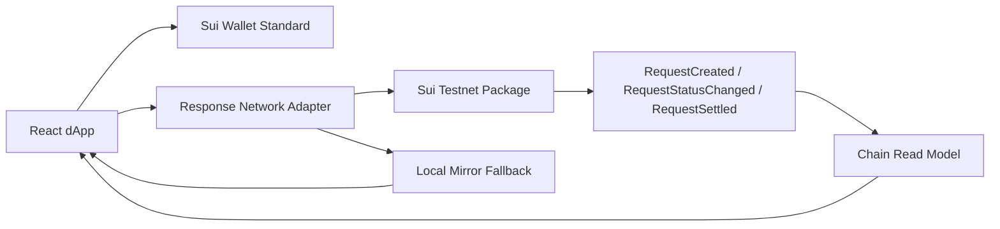
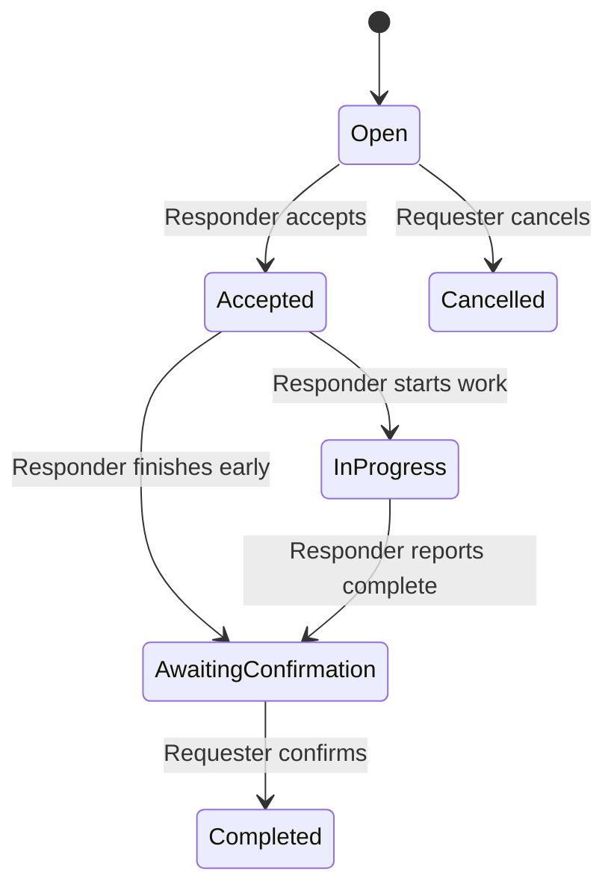

# Frontier Response Network

Frontier Response Network is a Sui-powered rescue dispatch dApp for EVE Frontier pilots.
It lets a requester post an SOS, lock a bounty on-chain, assign a responder, move the mission
through its status lifecycle, and release funds only after requester confirmation.

## Why this matters

- Rescue work becomes a verifiable contract instead of an off-platform promise
- The reward is locked before the responder commits to the mission
- Judges can inspect request ids, transaction digests, package ids, and registry ids directly in the UI
- The app keeps working when chain reads degrade, but it now makes the fallback explicit

## What ships in this repo

- `apps/web`: React + Vite dApp
- `contracts/response-network`: Sui Move package for the rescue lifecycle and escrow
- `packages/shared`: shared request / escrow models
- `docs`: PRD, dev guide, execution plan, and demo rehearsal script

## Judge-facing proof surface

- Wallet rail exposes full wallet address, live `SUI` balance, `packageId`, `registryId`, copy actions, and explorer links
- Request detail exposes `requestId`, latest transaction digest, escrow posture, payout recipient, and a full contract activity feed
- Request board and pilot console surface the latest proof digest without requiring a deep drill into source code
- Chain read degradation is explicit: the UI shows a banner, fallback label, and retry action instead of silently masking RPC failures

## Architecture



## State flow



## Local run

1. Install dependencies:

   ```bash
   npm install
   ```

2. Copy the frontend env values:

   ```bash
   cp apps/web/.env.example apps/web/.env.local
   ```

3. Start the app:

   ```bash
   npm run dev
   ```

   Routes:

   - `/`: public landing page
   - `/dashboard`: operator dashboard
   - `/dashboard/requests`: live request board
   - `/dashboard/requests/new`: publish flow
   - `/dashboard/me`: wallet-scoped pilot console

4. Daily verification commands:

   ```bash
   npm run typecheck
   npm run build
   npm run test:smoke
   cd contracts/response-network && sui move test
   ```

## Testnet deployment

| Item | Value |
| --- | --- |
| Network | `testnet` |
| Package ID | `0x49fa5c1a7bc586d9a733b5eea5fc264d4f40fa1e7463925ee6f5c14448eeaa99` |
| Registry ID | `0x46dbf80c58d61fae8bb68bd3e9d12ae6b61e3c150f9b8043bfbe91e70f4693c4` |
| Publish Digest | `97PxiKcJ7kdLtNK3vaVoBEqRyocMWyFEoP5YbHmJeCWw` |
| Deployment Record | `contracts/response-network/deployments/testnet.json` |

## Demo video location

- Final hosted demo URL: `TBD before submission`
- Rehearsal script and recording checklist: `docs/frontier-response-network-demo-script.md`

## Documentation map

- Product / architecture notes: `docs/frontier-response-network-prd.md`
- Builder handbook: `docs/frontier-response-network-dev-guide.md`
- Active execution plan: `docs/frontier-response-network-7-day-execution-plan.md`
- Demo script: `docs/frontier-response-network-demo-script.md`

## Known limitations

- Reads still rely on event/object polling instead of a dedicated indexer
- The local mirror and cached snapshot improve resilience, but chain state is still the only source of truth
- Frontend smoke coverage focuses on the core publishing and settlement story, not a full browser E2E matrix yet
- Demo video URL still needs to be added before final submission
